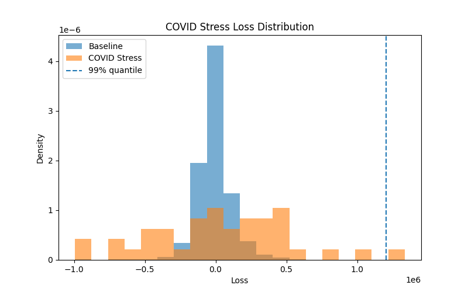
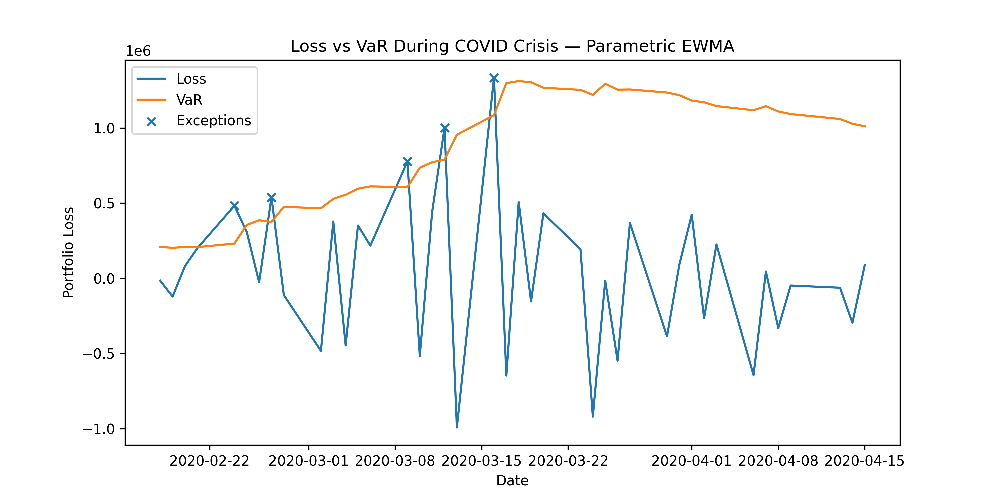
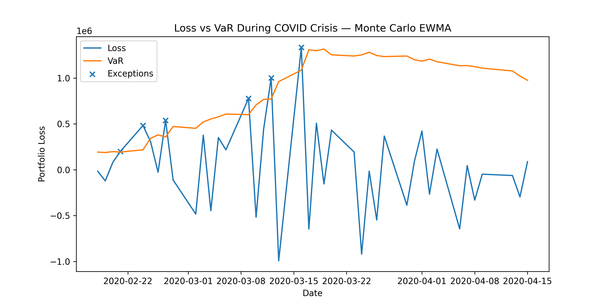
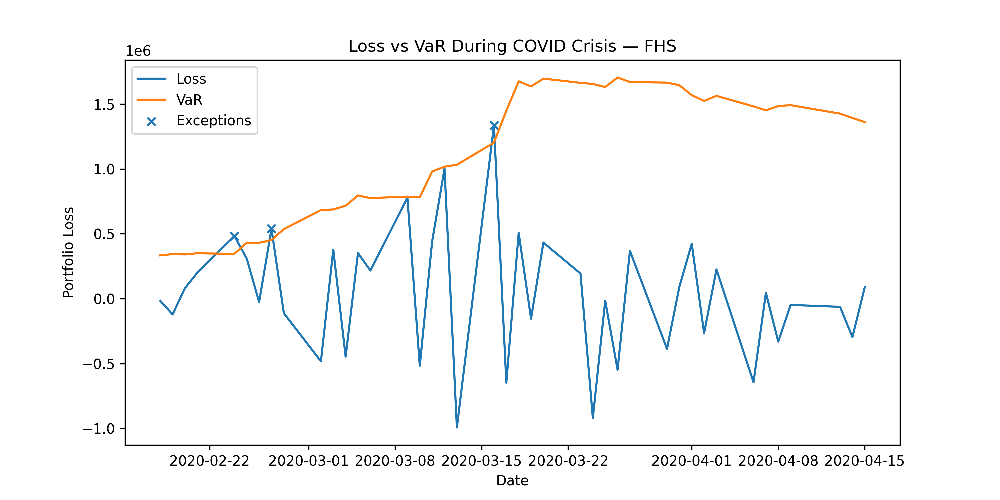

# Market Risk Capital Engine
### VaR / Expected Shortfall Modeling, Backtesting, and Stress Testing
Portfolio: Large-cap equity basket  
Horizon: 1 day  
Confidence: 99%

### 1. Overview
This project implements a small market risk engine for estimating and validating
Value-at-Risk (VaR) and Expected Shortfall (ES) for a multi-asset equity portfolio.
The system includes several VaR methodologies, rolling backtesting, statistical
coverage tests, and stress testing scenarios.

The objective is to evaluate model performance during both normal market regimes
and stressed conditions, and to analyze the procyclicality of VaR-based capital
estimates.

### 2. Portfolio and Data
The portfolio consists of 10 large-cap US equities with equal weights.
Daily adjusted prices were obtained from Yahoo Finance.

Sample period:
2012–2024

Returns:
daily log returns

Portfolio PnL is computed as
$$PnL_t = V * (w' r_t)$$
where V is the portfolio notional.

### 3. Risk Models
- Historical VaR estimates the loss quantile directly from the empirical PnL
distribution without distributional assumptions.
- Delta-normal VaR assumes multivariate normal returns:
$$VaR = z_\alpha \sqrt{w^T\Sigma w}V$$
with two covariance estimators: sample covariance and EWMA
- Monte Carlo VaR simulates portfolio returns from a multivariate distribution estimated
from historical returns.
- Filtered Historical Simulation removes time-varying volatility by
standardizing returns using EWMA volatility and rescaling shocks
with current volatility.

### 4. Backtesting
A rolling 250-day estimation window is used.

For each day:
1. estimate model parameters
2. forecast 1-day VaR
3. compare with realized PnL

Kupiec test results:
| Model              |   exceptions |   observations |         LR |     p_value |
|:-------------------|-------------:|---------------:|-----------:|------------:|
| Historical         |           50 |           3173 |  9.04251   | 0.00263774  |
| Parametric EWMA    |           69 |           3173 | 33.1084    | 8.71608e-09 |
| Monte Carlo Sample |           94 |           3173 | 80.8767    | 0           |
| Monte Carlo EWMA   |           81 |           3173 | 54.0611    | 1.944e-13   |
| FHS                |           33 |           3173 |  0.0506806 | 0.821883    |

Christoffersen conditional coverage test results:
| Model              |      LR |     p_value |   kupiec_LR |   independence_LR |
|:-------------------|--------:|------------:|------------:|------------------:|
| Historical         | 19.8421 | 4.91292e-05 |   9.04251   |          10.7996  |
| Parametric EWMA    | 36.1413 | 1.41909e-08 |  33.1084    |           3.03291 |
| Monte Carlo Sample | 87.9444 | 0           |  80.8767    |           7.06773 |
| Monte Carlo EWMA   | 57.2478 | 3.70481e-13 |  54.0611    |           3.18676 |
| FHS                | 13.2361 | 0.00133604  |   0.0506806 |          13.1854  |

FHS produced the most accurate unconditional coverage, with 33 exceptions versus 31.7 expected,
while parametric models significantly underestimate tail risk.
All models fail the joint conditional coverage test at the 5% level, which 
is consistent with known limitations of VaR models during volatility regimes.

### 5. Stress Testing
#### Historical Stress: COVID Crash
- The stress window covers February–March 2020.
- Losses during this period significantly exceed model VaR estimates.

Capital Shortfall Ratio for Selected Models:

| Model            |   Worst Loss |          Avg VaR |   Stress Loss / Normal VaR |   Observations |   Exceptions |   Exception Rate |
|:-----------------|-------------:|-----------------:|---------------------------:|---------------:|-------------:|-----------------:|
| Parametric EWMA  |   1.3357e+06 | 861531           |                    1.55038 |             41 |            5 |        0.121951  |
| Monte Carlo EWMA |   1.3357e+06 | 857569           |                    1.55754 |             41 |            6 |        0.146341  |
| FHS              |   1.3357e+06 |      1.11801e+06 |                    1.19471 |             41 |            3 |        0.0731707 |

Observed losses during the COVID crash exceed model VaR by
more than 1.2-1.5 times for most models.

{width=50%}
{width=50%}
{width=50%}

All models experienced substantially more exceptions than expected, indicating that the extreme market conditions were not well captured by the VaR models calibrated on historical data. Overall, Filtered Historical Simulation appears more robust in crisis conditions, as it better captures heavy-tailed return behavior.

#### Hypothetical Shock
Volatility scaling: 2
Correlation floor: 0.9

VaR Uplift Results
| Model              |   Baseline |   Stressed |   Uplift |
|:-------------------|-----------:|-----------:|---------:|
| Parametric Sample  |     290119 |     711268 |  2.45164 |
| Monte Carlo Sample |     291674 |     712868 |  2.44406 |
| Parametric EWMA    |     141553 |     479100 |  3.3846  |
| Monte Carlo EWMA   |     143590 |     477078 |  3.3225  |

The stress scenario produces substantial capital amplification,
highlighting the sensitivity of VaR estimates to volatility and
correlation shocks.

### 6. Procyclicality
VaR models are inherently procyclical.

During calm market regimes, estimated volatility and correlations are low,
leading to smaller VaR estimates and lower capital requirements.

However, during crises volatility and correlations increase sharply,
causing large losses and sudden jumps in required capital.

The stress tests demonstrate that losses during crisis periods
can substantially exceed VaR forecasts estimated from normal periods.

### 7. Model Limitations
Limitations of the current framework include:

- Normality assumption in parametric models  
- Instability of covariance estimates  
- Limited treatment of extreme tail events  
- Lack of nonlinear instruments in portfolio valuation  
- Dependence on historical data for stress calibration

### 8. Conclusion
The analysis shows that volatility-adjusted models such as
Filtered Historical Simulation perform better in backtesting
and better capture tail risk during stress periods.

However, all VaR models exhibit sensitivity to regime changes,
highlighting the importance of complementary stress testing
in market risk management.